# 전체 질문

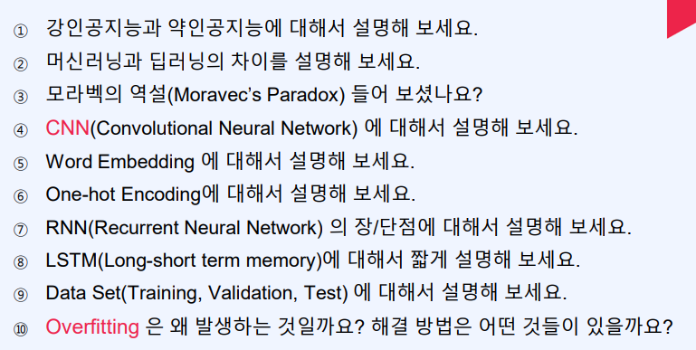

1. 강인공지능 vs 약인공지능

   강인공지능 : 완벽하게 인간을 모방하여 명령없이도 스스로 판단하고 결정함

   약인공지능 : 주어진 판단범위 내에서만 판단

2. 머신러닝 vs 딥러닝

   머신러닝 : 해답을 위한 주요특징만 인간이 결정하고, 판단 모델은 기계학습을 통해 구현됨

   딥러닝 : 비정형 데이터로부터 인공신경망(입력층, 은닉층, 출력층) 학습을 통해서 모든것을 기계가 구현함

3. 모라벡의 역설 : 인간에게 어려운 것(복잡한 연산)이 컴퓨테에게 쉽고, 인간에게 쉬운것(구분)이 컴퓨터에게 어려움

4. CNN(Convolutional Neural Network) : 일반 딥 네트워크에서 이미지나 영상과 같은 데이터를 처리할 때 발생하는 문제를 보완하는 방법, 주로 Convolutional filter를 적용, fulling, subceps, subsampling을 통한 뒤에 fully contacted layer를 통해 flattened 작업을 함

5. Word Embedding

   분석하기 쉽게 나뉜 토큰을 활용하여 해당 단어를 컴퓨터가 이해하기 편한 수치화 하는 작업

6. One-hot Encoding

   단어 집합의 크기를 벡터의 차원으로 하고, 표현하고 싶은 단어의 인덱스에 1의 값을 부여하고, 다른 인덱스에는 0을 부여하는 벡터 표현 방식

7. RNN(Recurrent Neural Network) 

   장점 : 시간의 흐름에 따라 변화하는 시계열 데이터에 적용하는 모델 

   단점 : 시게열이 오래될수록 초반 변화값들이 영향력이 적어짐

8. LSTM(Long-short term memory) : RNN의 단점을 극복하기 위해서 sales state 모듈을 두고 추후에 정보를 추가할지 감소할지 데이트 구조에 의해 제어가 되는 시계열 학습

9. Data Set(6:2:2 or 8:1:1)

   Training : 모델 학습에 사용되는 데이터, 너무 많으면 overfitting

   Validation :  성능 측정해서 일반화에 기여

   Test : 학습 관여 ㄴ, 모델의 성능 평가

10. Overfitting 왜 발생함? : 학습데이터 부족 or 데이터 특성에 비해 모델이 너무 복잡한 경우 발생(trainingset에 너무 과적합한 훈련을 시킬 경우)

    해결방법 : dropout, earlystop, data argumentation 적용, cross validation, 모델의 복잡도 감소시키기

# AI

## 질문

--------------------

1. AI란?

   인간의 학습능력, 추론능력, 지각능력이 필요한 작업을 할 수 있도록 컴퓨터 시스템을 구현하려는 컴퓨터 과학의 한 분야

2. 머신러닝 vs 딥러닝

   머신러닝 : 해답을 위한 주요특징만 인간이 결정하고, 판단 모델은 기계학습을 통해 구현됨

   딥러닝 : 비정형 데이터로부터 인공신경망(입력층, 은닉층, 출력층) 학습을 통해서 모든것을 기계가 구현함

-------

* 정의

  인간의 학습능력, 추론능력, 지각능력이 필요한 작업을 할 수 있도록 컴퓨터 시스템을 구현하려는 컴퓨터 과학의 한 분야

* 종류 : 강인공지능, 약인공지능
* 한계점 : 단일층이었을 때 AND, XOR 연산못함 -> multilayer가 되면서 해결 됨

## 강인공지능 vs 약인공지능

강인공지능 : 완벽하게 인간을 모방하여 명령없이도 스스로 판단하고 결정함

약인공지능 : 주어진 판단범위 내에서만 판단

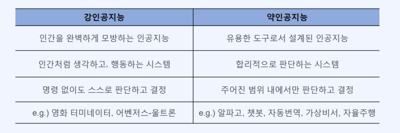

## 머신러닝 vs 딥러닝

머신러닝 : 해답을 위한 주요특징만 인간이 결정하고, 판단 모델은 기계학습을 통해 구현됨

딥러닝 : 비정형 데이터로부터 인공신경망(입력층, 은닉층, 출력층) 학습을 통해서 모든것을 기계가 구현함

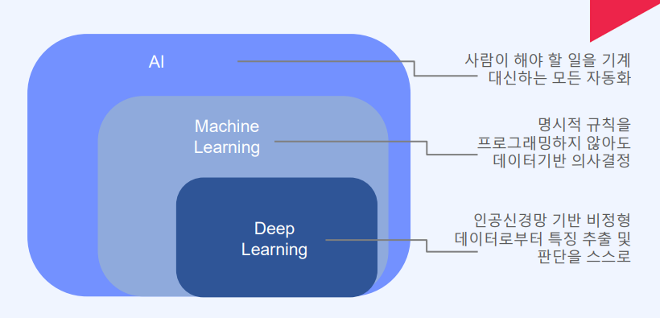

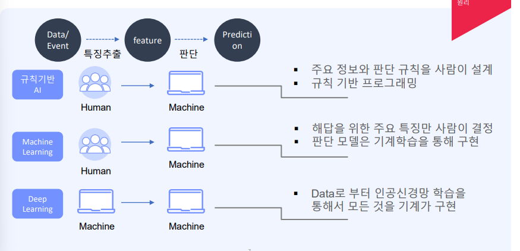

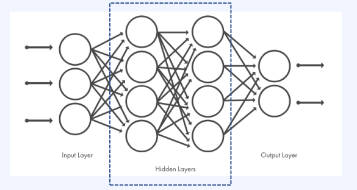

# NLP

## 질문

1. 인간의 언어 현상을 컴퓨터와 같은 기계를 이용해서 묘사할 수 있도록 연구하고 이를 구현하는 인공지능의 주요 분야

2. Word Embedding

   분석하기 쉽게 나뉜 토큰을 활용하여 해당 단어를 컴퓨터가 이해하기 편한 수치화 하는 작업

3. One hot encoding

   단어 집합의 크기를 벡터의 차원으로 하고, 표현하고 싶은 단어의 인덱스에 1의 값을 부여하고, 다른 인덱스에는 0을 부여하는 벡터 표현 방식

4. Word2Vec = CBOW + skip-gram

   CBOW : 주변 단어로부터 중심단어를 추측하는 신경망

   skip-gram : 중심단어로부터 주변 단어를 추측하는 신경망

------

* 정의 

  인간의 언어 현상을 컴퓨터와 같은 기계를 이용해서 묘사할 수 있도록 연구하고 이를 구현하는 인공지능의 주요 분야

* 종류

  NLP > NLU, NLG

  * NLP : 컴퓨터가 자연어 묘사 

  * NLU : 언어 구조에 대한 이해

  * NLG : 자연어 출력 생성

    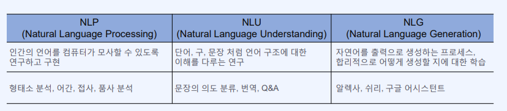

* 전처리 과정

  

## Tokenizing

* 각 나라의 언어적 특성을 반영하고 말뭉치(Corpus)를 활용하여 Text를 특정 기준(토큰)에 맞게 나누는 작업

* python-KoNLPy

  * morphs : 형태소 추출
  * pos : 품사 태깅
  * nouns : 명사 추출

  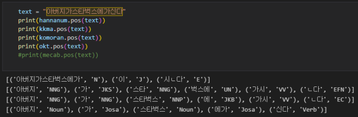

## One-hot Encoding

단어 집합의 크기를 벡터의 차원으로 하고, 표현하고 싶은 단어의 인덱스에 1의 값을 부여하고, 다른 인덱스에는 0을 부여하는 벡터 표현 방식

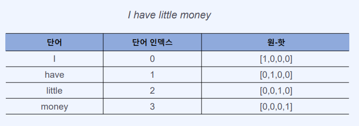

## Word Embedding

* 정의

  분석하기 쉽게 나뉜 토큰을 활용하여 해당 단어를 컴퓨터가 이해하기 편한 수치화 하는 작업

* 종류

  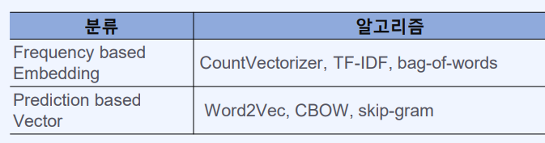

  * Frequency basedEmbedding

    * 통계기반
    * 유사성만이 표현 됨

  * Predictions Prediction based Vector

    * 딥러닝 기반

    * 단어 사이의 패턴도 학습

    * 종류 

      * Word2Vec = CBOW + skip-gram

        * CBOW

          주변 단어로부터 중심단어를 추측하는 신경망

          학습시간은 말뭉치가 적을수록 skip-gram보다 빠름

          입력층 : 주변 단어들 one-hot vector

          출력층 : 중심 단어 one-hot vector

          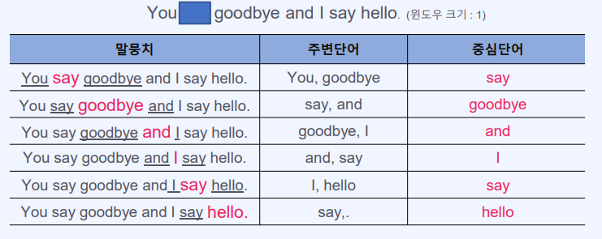

          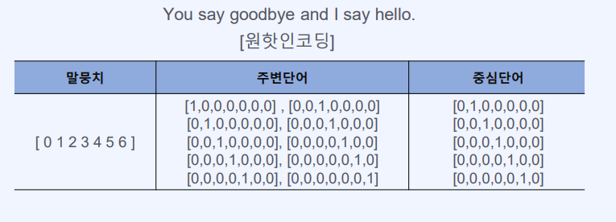

        * skip-gram

          중심단어로부터 주변 단어를 추측하는 신경망

          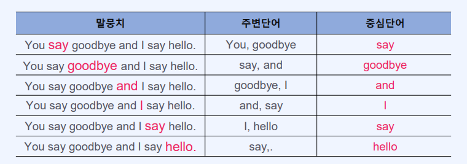

