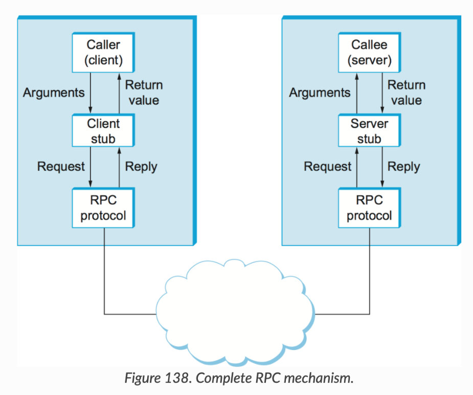

# 1. API란?

Application Program Interface

애플리케이션(운영체제에서 실행중인 모든 소프트웨어)에서 데이터를 읽거나 쓰기 위해 사용하는 인터페이스(애플리케이션과 서버간 소통하기 위한 접점)


# 2.  Open API

인터넷 상에서 호출 가능한 API

HTTP(통신규약) API

호출(URL + Parameter) -> 응답(XML or JSON)


# 3. SDK

Software Developement Kit

소프트웨어 개발 API를 모아둔 라이브러리


# 4. 종류

## 정리표

|          |                      SOAP                      |               REST               | GraphQL                                    | RPC                                                          |
| -------- | :--------------------------------------------: | :------------------------------: | ------------------------------------------ | ------------------------------------------------------------ |
| **목적** |               동봉된 메시지 구조               | 6가지의 아키텍쳐  제약조건 준수  | 스키마 시스템                              | 로컬 프로시저 호출                                           |
| **형식** |                      XML                       |          JSON,XML,HTML           | JSON                                       | JSON,XML,Probuf,Thrift,FlatBuffers                           |
| 난이도   |                     어려움                     |               쉬움               | 중간                                       | 쉬움                                                         |
| 용도     | 엄격한 보안성(금융, 통신, 마케팅, 결제 시스템) | 공공 API, 간단한 리소스 기반 app | 모바일 API, 복잡한 시스템, 마이크로 서비스 | 명령어 기반 API, 거대한 마이크로 서비스에서 높은 성능의 의사소통을 하고 싶을 때 |


## SOAP

* SOAP(**Simple Object Access Protocol)**

* 장점

  * 웹 기반 서비스를 생성하는 HTTP프로토콜을 사용하므로 언어와 플랫폼에 독립적이다. 

  * WS-Security, SSL 등의 기능을 지원하여 메세지 수준에서 암호화가 가능하고 개인 정보 보호 및 무결성을 제공한다,

  * SOAP은 **엄격한 보안성**을 가지고있기에 , **금융, 통신, 마케팅, 결제 시스템**과 같은 **기업용 서비스에 사용**되는 장점이있다.

* 단점

  * **XML 형식**만 사용할 수 있다.
  * **캐시기능을 사용할 수 없다**.
  * **많은 리소스와 대역폭을 필요**로 하므로 오버헤드가 큰 편이다.
  * SOAP API 서버 구축을 위해서는 매우 제한된 규칙에 대해 전문적이고 깊은 이해가 필요하다.


## REST

* **REST** (**RE**presentational **S**tate **T**ransfer)

* 리소스 + HTTP Method로 표현

* SOAP 차이점

  

* 6가지 제약조건

  * Client-Server
  * Stateless
  * cache
  * uniform interface
  * layered system
  * code-on-demand

  

## GraphQL

* 필요한 데이터만 받을 수 있음

  ```
  /graphql?query={ book(id: "1") { title, author { firstName } } }
  
  
  {
    "title": "Black Hole Blues",
    "author": {
      "firstName": "Janna",
    }
  }
  ```


## gRPC

* **Remote Procedure Calls**로 오픈소스 원격 프로시저 호출 시스템

* 클라이언트에서 만든 함수를 사용하여 요청할 수 있음

  

  * **RPC**는 **Stub**을 이용해 IDL 호출규약을 정의
  * 클라이언트에서 구현된 원시코드 형태의 함수가 Server에 동시구현
  * 만들어진 Stub코드는 Cli/Svr에서 동시 컴파일
  * 클라이언트의 요청으로 Server내에 원격 프로시저가 호출이 되고, 결과값을 반환 받음