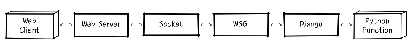

# 하는 일

1. API
2. DB 생성 및 튜닝
3. 배치 프로그램

# 1. 서버환경 구성(선택)

## 0. 선택기준

1. 스타트업이면 함

2. 대기업, 금융기업은 기존 서버 사용함 -> AWS 사용해봤다 정도 충분

## 1. 서버 생성 및 올리기

1. AWS EC2 인스턴스 생성
2. 로컬 환경에서 Django 프로젝트 만들어 Github에 연동 
3. AWS EC2에 git에 연동한 프로젝트를 불러와 실행
4. 그 이후 수정
   1. 로컬에서 소스 수정
   2. commit 후 push
   3. 서버에서 git pull로 변경된 소스 반영

### Ref

[서버 환경 구성](https://cholol.tistory.com/484?category=966420)

## 2. 웹서버 실행을 위한인터페이스 세팅, DB 연동

* 웹서버를 실행하기 위해 웹서버와 Django 사이에 인터페이스 필요함
* 웹서버에 DB 연동

### 구조

### 설치 및 세팅

1. uWSGI 
2. Nginx 
   1. core 모듈
   2. event 블록
   3. http 블록
   4. mail 블록
3. DB(Mysql) - Django 연결 by docker

### Ref

[ref](https://cholol.tistory.com/485?category=966420)

## 3. 서버를 docker화 하기

### 장점

운영/배포에 이점

### 과정

1. docker로 만들기 Django 만들기
2. docker로 만들기 Nginx 만들기
3. docker-compose로 Nginx docker 와 django docker 연결하기

### Ref

[ref](https://cholol.tistory.com/489?category=966420)

# 2. API 만들기

## 0. 선택기준

* 하고 있는거는 Django
* 내가 원하는거는 Spring 

## 1. DRF 설치하기

## 2. LOGIN API 만들어보기

## Ref

[ref](https://cholol.tistory.com/497?category=966420)