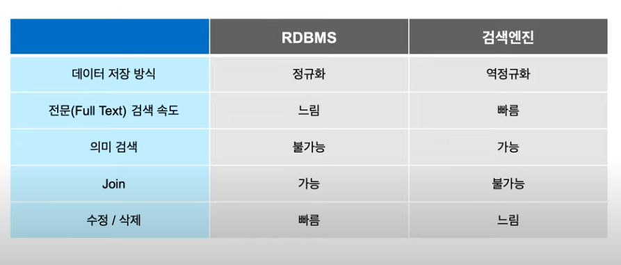
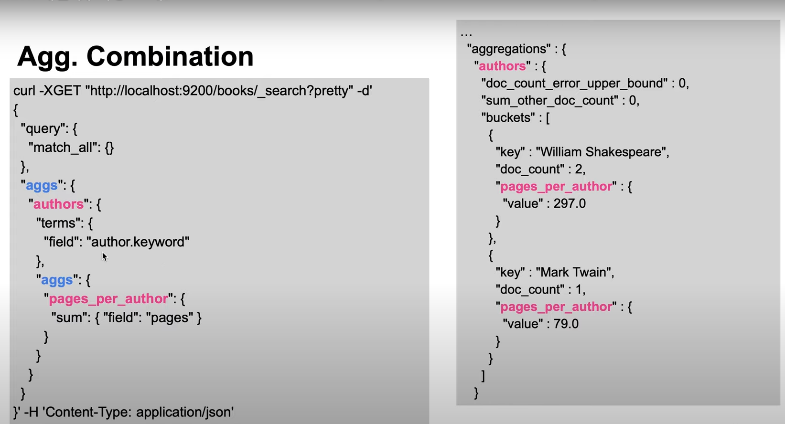

# 1. Elasticsearch 란?

# 2. Elastic stack 란?

Elastic Stack = Elasicsearch + Logstash + Kibana + Beats

1. Elasticsearch 

   데이터 저장, 검색, 분석 엔진

2. Kibana

   데이터 시각화 및 전체 stack 관리하는 클라이언트 도구

3. Logstash

   데이터 시스템으로 부터 데이터 수집 및 전송 ETL 도구

   사용 장비에 설치해야 됨

4. Beats

   데이터 시스템으로 부터 데이터 수집 및 전송 ETL 도구

   장비에 Logstash 설치가 어려운 경우가 있어 계발

# 3. 기능

# 4. 상용 기능들

무로 소스들은 내포해서 재판매 안됨

# 5. Elasticsearch 특징

1. 분산 시스템 -> 스케일 아웃 가능

2. REST API 지원하면 RESTFul 한 속성을 가지고 있음

   

3. 검색 방법

   1. URI + _search + ?q=~~~

   

   2. http 본문에 쿼리 삽입(더욱 복잡한 질의를 할 수 있음)

      

   4. 풀텍스트 검색이 가능

      1. RDBMS는 열을 기준으로 인덱스를 만듦

      

      2. Elasticsearch는 RDBMS와 반대로 텍스트를 분석해서 검색어 사전을 만듦

	

# 7. 텍스트 분석

1. 과정
   1. 텍스트 분석은 보통 빈칸기준으로 나눔(White Tokenizer)
   2. 소문자로 통일(Lowercase Token Filter)
   3. 토큰 (보통 아스키 순서로)정렬
   4. 불용어 제거(Stop Token Filter)
   5. 형태소 분석(~s, ~ing 제거) (Snowball Token Filter)
   6. 토큰 병합
   7. 동의어 처리(Synonym Token Filter)

​	2. 미리보기

# 8. 검색 과정

1. 텍스트 처리

2. 검색엔진 vs RDBMS

   

# 9. 한글 검색

1. 띄어쓰기가 아닌 단어 사전 기반으로 분석이 필요함
2. Nori 사용

# 10. match 검색

검색어도 분석과정을 거침

# 11. Mapping

# 12. Keyword 검색

검색시 대소문자까지 일치해야 됨

# 13. Aggregation

집계

Type을 Keyword로 하는 이유

2. 종류

   

3. 사용법

   keyword field 필요

   

4. 조합 가능

   

5. kiban Aggregation 사용한거

# 6. Apache Lucene

풀스택 검색 엔진을 만들 수 있는 자바 라이브러리

Elasticsearch는 Apache Lucene으로 구현된 검색엔진임

# 6. 클러스터링 과정

샤드 : 루씬 검색 쓰레드

노드 : Elasticsearch 실행 프로세스

1. 데이터를 샤드 단위로 분리해서 저장

2. 노드를 여러개 실행시키면 같은 클러스터로 묶인다.

   

3. 샤드들은 각각의 노드에 분배되어 저장됨

   

4. 무결성과 가용성을 위해 복제본을 만듦, 복제본은 다른 노드에 저장됨

   

5. 시스템 다운이나 네트워크 단절 등으로 노드가 유실되도 복제과정으로 인해서 유실이 없음

   

6. 1개 밖에 없는 샤드들은 다시 살아있고 다른 노드 중에 복사함

   

   

7. 노드가 줄어도 데이터 무결성 유지

   

# 7. 검색 과정

1. Query Phase

   1. 클라이언트가 쿼리 수행 명령 -> 노드가 명령 받음 -> 모든 샤드에 전달 -> 모든 샤드는 검색 실행

      

   2. 요청된 크기만큼의 검색 결과 큐(루씬 doc id, 랭킹 점수)를 노드로 리턴

      

2. Fetch Phase

   1. 노드는 리턴된 결과물을 랭킹 점수를 기반으로 정렬 -> 유효한 샤드들에게 최종 결과물을 다시 요청

      

   2. 노드에게 전체 문서 내용 등의 정보가 리턴 -> 클라이언트에게 전달

      

# 3. 네이버클라우드 플랫폼의 Elasticsearch 사용하는 이유

1. 손쉬운 설치
2. 손쉬운 관리

1. RDBMS에 비해 왜 빠른가?

   RDBMS는 하나씩 들어가서 값을 확인함

   Elastic Search는 안들어가도 한번에 확인 가능함

2. 장점

   open source -> 무료, 빠른 버그 픽스

   빅데이터 빠르게 처리 가능

   

3. 단점

   진입장벽

   join 불가

   트랜잭션 제공 안함

