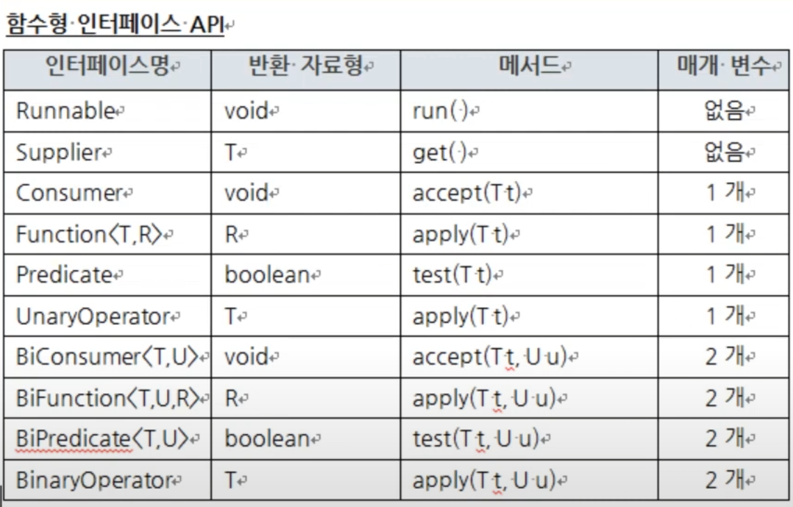

lambda, stream, enum

1. var : 타입추론 변수, 지역변수

2. 코드템플릿(함수설명) : alt + shift + j 

3. API 제작 : Project -> Generate javadoc

   한글 있을 경우 : VM options에 '-locale ko_KR -encoding UTF-8 -charset UTF-8 -docencoding UTF' 입력

4. 배열 -> 문자열 변환 

   1. Arrays.toString(a); -> 1차원
   2. Arrays.deepToString(a); -> n차원

5. Arrays.equals(a,b);

6. 배열 -> 리스트 : Arrays.asList(배열) 

7. getter, setter 단축키 : alt + shift + s,r

8. 접근제어자 default : 같은 패키지면 사용 가능 - 접근제어자 안쓰면 자동으로 됨

9. F3 : 해당 메소드 찾아감

10. 지역클래스 : 클래스 -> 함수 -> 클래스

11. 익명 내부 클래스 

    1. 인터페이스 클래스 밖에 선언(함수 포함)
    2. 실행 메소드 안에서 인터에이스를 사용한 인스턴스 생성
    3. overriding함
    4. 인스턴스.메소드() 실행

12. 정적 중첩 클래스

    클래스  안에 static class 만들기

    클래스 사용시 '상위 클래스 이름 = new 상위 클래스.하위클래스()'

13. 참조 클래스 비교

    1. == 주소 비교
    2. 사용한는 클래스에 Generete hashcode(), equals() 로 overriding 하면 ->  equals()로 값 비교 가능

14. 캡슐화 : priavte 변수 + public 함수

15. 접근제어자 

    1. default : 같은 패키지
    2. public : 모두 가능
    3. protected : 상속 + 같은 패키지만

16. Lombok : 뻔한 작업 대신해줌
    1. @Getter, @Setter
    2. @ToString
    3. 생성자
       1. @NoArgsConstructor	:  비어있는 생성자
       2. @AllArgsConstructor : 모든 변수 매개변수 생성자
       3. @RequiredArgsConstructor
          1. 인수 넣을 변수 위에 @NonNull
          2. final 변수로 하기(@NoArgsConstrucotor 없어야 됨)
    4. @Data : @Getter + @Setter + @ToString + @RequiredArgsConstructor
    5. @Builder : class 수정 없이 생성자 overloading 가능
       1. class 생성자 위에 @Builder
       2. 값 초기화 : class이름 이름 = class이름.builder().변수이름(값) x 여러개.build();

17. 추상클래스 : 기존틀 사용+ 다른 틀(abstract) 나중에 구현

    1. 공통 속성 및 함수 작성

    2. 다른것만 abstract 하고 함수구현 하지않고 함수만 작성

    3. extedns로 상속받기

    4. 생성자, abstract한거 구현하기

       

18. 추상클래스 다형성

    1. 다운캐스팅(부모->자식)은 가능
    2. 업캐스팅(자식->부모)은 불가능 -> 자식클래스만 가진 함수를 부모클래스로 선언 후 사용하면 못씀

19. Interface 
    1. 여기서 그냥변수는 static final : 변경 못함
    2. 여기서 그냥함수는 abstract : 모두 implements한 class가 직접 구현해야 됨
    3. default 함수 : 공통함수 -> 바꾸고 싶으면 implements한 class에서 @Overrride

20. 한번에 implements 여러개 가능
21. 일반클래스 상속 : 변경하고 싶거나 추가하고 싶은거만 작성, 나머지는 부모거 그대로쓸수 있음
22. generic : 미리 자료형을 정해서 문제 방지, 재샤용률이 높아짐, var 사용가능
    1. 제한된 자료형 제네릭
    2. 생성자의 제네릭

23. TreeSet : 중복ㄴ + 정렬 
24. TreeMap : key  + 정렬

25. cntrl + shift + [ : 똑같은 페이지 2개로 보기 -> 코드가 길어질 때 보기 편리

26. 람다식으로 추상메서드 구현하기

    @FunctionalInterface : 1개의 추상메서드를 뜻함

    1. 인터페이스 + 추상메서드 + @FunctionalInterface(선택)  생성 후 -> 인터페이스이름 이름 = (매개변수이름)  -> {구현};

    2. 기존거 사용 -> 인터페이스이름 이름 = (매개변수)  -> {구현}

       

27. 함수형 인터페이스 API

    1. Supplier : 매개변수는 없지만 반환자료형은 있음

       Supplier<반환자료형> 이름 = () -> {반환할거}

    2. Consumer : 매개변수는 1개, 반환 자료형은 없음

       Consumer <매개변수자료형> 이름 = () -> {구현}

       