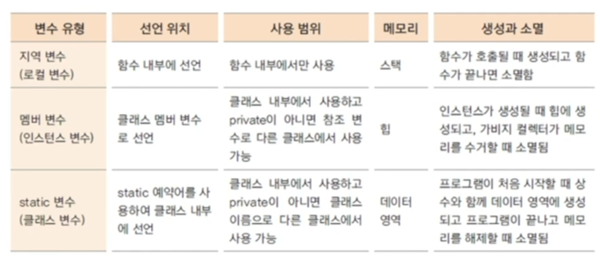

1. 객체란?

2. class, 멤버변수, 메서드

3. 메모리

   

4. 생성자

5. 접근제어자, 캡슐화(private) 

6. static 변수, 메서드, 메모리, 싱글톤 패턴

7. 배열

8. 객체 배열 : 공간 배정후 ,생성자 써줘야 됨

9. 얕은 복사 vs 깊은 복사

10. ArrayList(사용이유, 함수)

    

    


모르는거

1. stack 메모리 : 지역변수 임시 저장

2. 인스턴스 : 클래스를 메모리에 생성한 상태

3. 참조변수 : 메모리에 생성된 인스턴스를 가리키는 변수 -> stack 메모리

4. 참조 값 : 생성된 인스턴스의 메모리 주소 값

5. heap 메모리 : 인스턴스

6. 캡슐화 장점 : 메서드나 멤버 변수를 접근함으로써 발생하는 오류 최소화

7. static : 데이터 영역 메모리

8. singleton pattern : 인스턴스를 하나만 만들고 싶을 때 사용 ex) Calendar, Date

   ```java
   public class Company {
       private static Company instance = new Company();
       private Company() {}
       
       public static Company getInstance() {
           if(instance == null) {
               instance = new Company();
           }
           return instance;
       }
   }
   ```

   

9. 배열 개념 : 동일한 자료형의 순자적 자료구조, 물리적 위치와 논리적 위치 동일

10. 객체 복사
    1. 얕은 복사 : 공간만 배치하고, 주소 복사
    2. 깊은 복사 : 공간, 생성자로 인스턴스 생성 후 , 값 복사