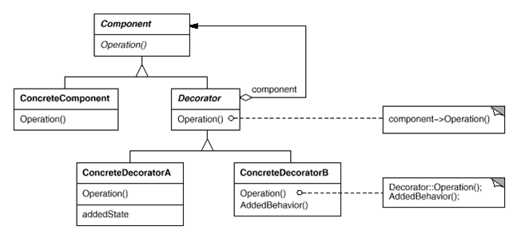

1. 내부 클래스 : 클래스 내부에서만 사용

   1. 인스턴스 내부클래스 : 외부클래스를 생성해야 사용할수 있음
      1. 멤버 변수로 내부클래스 선언
      2. 클래스 내부에 private으로 클래스 구현
      3. 클래스 기본생성자로 내부클래스 생성
      4. 함수로 내부함수의 함수 호출

   2. 정적 내부 클래스 : 외부클래스를 생성하지 않아도 사용가능

      1. static으로 구현

      2. 정적변수, 정적 메서드 사용

         

   3. 지역 내부 클래스 : 외부클래스 메서드안에서 내부 클래스 생성

      1. 주의점 : 함수내 변수는 상수화 시켜서 값을 변경 못함

   4. 익명 내부 클래스 : 이름이 없는 클래스 -> 가장 많이 사용

      1. 클래스 이름 생략

      2. 하나의 인터페이스나 추상 클래스를 구현하여 반환

         ```java
         Runnable runner = new Runnable() {
         		
         		@Override
         		public void run() {
         			System.out.println("Runnable 이 구현된 익명 클래스 변수");
         			
         		}
         	};
         
         ```

         

 2. 함수형 프로그래밍과 람다식

    	1. 특징 : 클래스 생성 후 override로 구현할 필요 없이 바로 구현후 사용가능, JDK 8이상

        	2. 과정
        	
        	1. 인터페이스로 메서드 1개만 선언
        	2. 인터페이스이름 함수이름 = (매개변수) -> {구현;};
        	
        	3. @FunctionalInterface : 함수 한개만 선언할수 있음을 말해줌
        	
        	4. reduce() : 정의된 연산이 아닌 프로그래머가 직접 구현한 연산을 적용
        	
        	1. 형식 : Arrays.stream.reduce(초기값, 값들);
        	
        	2. 방법
        	
        	1. 객체 override
        	
        	   class 클래스이름 implements BinarOperator -> apply() override로 구현 -> Arrays.stream(매개변수).reduce(new 클래스이름())
        	
        	2. 람다식
        	
        	   Arrays.stream(매개변수).reduce(초기값, 구현)


3. 스트림
   1. 기능 : 자료의 대상(Array, List)과 관계없이 동일한 연산 수행
   2. 특징 : 재사용 불가, 기존 자료형 변경 ㄴ, 최종 연산자 호출 후 중간연산자 수행, 중간연산저 여러개 가능 / 최종연산자 1개
   3. 중간연산자 종류 : 
      1. filter() : if문
      2. map() : 변수 가져오기
      3. mapToInt() : 정수형 변수 가져오기
      4. sorted() : 정렬
   4. 최종연산자 종류 
      1. forEach() : 반복문 
      2. count() : 세기 
      3. sum() : 합


4. 예외처리

   1. 사용하는 이유 : 시스템 다운되면 방지, 오류 log남기기

   2. 오류

      1. Error : 프로그래머가 처리 할 수 없는 오류
      2. Exception : 프로그래머가 제어할수 있는 오류

   3. 예외처리

      1. try{실행} - catch(exception타입 e){에러시 실행} - finally{닫기}

      2. auto closeable

         try(실행) {}   - catch(exception타입 e){에러시 실행} -> finally로 close 안해줘도 됨

   4. 예외처리 미루기

   5. 사용자 정의 예외 클래스 정의

      1. 클래스로 exception 상속받기 -> 언제 예외처리할건지 구현하기(if, throw new 클래스이름("내용")) -> 실행하는 곳에 try - catch 구현

   6. 로그남기기

      로그를 레벨별로 분리할 수 있음


5. I/O
   1. 바이트 단위 입출력
      1. 입력
         1. 스트림 : 
            1. FileInputStream : 파일에서 바이트 단위로 자료를 읽습니다.
         2. 메서드
            1. int read() 입력 스트림으로부터 한 바이트의 자료를 읽습니다. 읽은 자료의 바이트 수를 반환합니다.
            2. int read(byte b[]) 입력 스트림으로 부터 b[] 크기의 자료를 b[]에 읽습니다. 읽은 자료의 바이트 수를 반환합니다.
            3. int read(byte b[], int off, int len) 입력 스트림으로 부터 b[] 크기의 자료를 b[]의 off변수 위치부터 저장하며 len 만큼 읽습니다. 읽은 자료의 바이트 수를 반환합니다.
            4. void close() 입력 스트림과 연결된 대상 리소스를 닫습니다.
      
      2. 출력
      
         1. 스트림 : 
      
            1. OutputStream : 파일에 바이트 단위로 자료를 씀
      
         2. 메서드
      
            1. int write() 한 바이트를 출력합니다.  
      
            2. int write(byte b[]) b[] 크기의 자료를 출력합니다.  
      
            3. int write(byte b[], int off, int len) : b[] 배열에 있는 자료의 off 위치부터 len 개수만큼 자료를 출력합니다.  
      
            4. void flush() : 출력을 위해 잠시 자료가 머무르는 출력 버퍼를 강제로 비워 자료를 출력합니다.  
      
            5. void close() : 출력 스트림과 연결된 대상 리소스를 닫습니다. 출력 버퍼가 비워집니다.
      
               

   2. 문자단위 입출력

      1. 입력

         1. 클래스
            1. FileReader : 파일에서 문자 단위로 읽는 스트림 클래스입니다.
         2. 메서드
            1. int read() 파일로부터 한 문자를 읽습니다. 읽은 문자를 반환합니다.  
            2. int read(char[] buf) 파일로부터 buf 배열에 문자를 읽습니다.  
            3. int read(char[] buf, int off, int len) 파일로부터 buf 배열의 off 위치로부터 len 개수만큼의 문자를 읽습니다.  
            4. void close() 입력 스트림과 연결된 대상 리소스를 닫습니다.

      2. 출력

         1. 클래스

         2. 메서드

            

            

   3. 보조 스트림 : 스트림에 추가기능 줌, 여러개 사용가능 , 보조(보조(stream))처럼 여러개 감쌀 수 있음

      1. 입력 
         1. InputStreamReader()  : 바이트 단위 읽기 -> 문자 단위 읽기 가능
         2. BufferedInputStream : 한번에 읽어서 빠르게함
         3. DataOutputStream : 메모리에 저장된 상태 그대로 읽기
      2. 출력 
         1. OutputStreamReader() : 바이트 단위 읽기 -> 문자 단위 쓰기 가능
         2. BufferedOutputStream : 한번에 읽어서 빠르게함
         3. DataOutputStream : 메모리에 저장된 상태 그대로 쓰기

      

   4. 직렬화 : 인스턴스의 상태를 그대로 파일 저장하거나 네트웍으로 전송하고 이를 다시 복원하는 방식

      1. Serializable 
         1. 인터페이스 상속 받은 객체클래스 구현(직렬화 안할 변수있으면 transient 사용)
         2. 보조스트림 형식으로 사용

      1. Externalizable : 프로그래머가 직접 객체를 읽고 쓰는 코드 구현

         1. 인터페이스 상속 받은 객체클래스 구현(writeExternal, readExternal)

         2. 보조스트림 형식으로 사용

            

   5. 그 외

      1. File 클래스 : 입출력 기능없음, 파일의 속성을 알 수 있음(이름, 경로, 읽기 전용) 
      2. RandomAccessFile 클래스 : 유일하게 파일에 대한 입력과 출력을 동시에 할 수 있음


6. 데코레이터 패턴

   상속보다 유연한 구현 방식(기능 추가, 제거)

   

   Component : 실제 인스턴스

   Decorator : 실제 인스턴스를 호출해서 기능 추가


7. Thread 생성

   1. Thread 클래스 상속

      상속 받고 run() 구현 -> 인스턴스 생성 -> start()

   2. Runnable 인터페이스 구현

      인터페이그 구현 -> 인스턴스 생성 -> new Thread(구현한 클래스) -> start()

   

8. Thread Status

   

​		Runnable : CPU 대기상태

​		Not Runnable : 일시적으로 쫓아냄 by sleep, wait, join

​		Dead : 종료

​		Run : CPU 할당 됨


9. Thread 클래스의 매서드
   1. setPriority() : 쓰레드의 우선순위 정하기
   2. join() : 쓰레드 결과값을 참조해야 할 경우, 쓰레드가 끝날때 까지 기다리라고 함
   3. interrupt() : 강제로 Not Runnable -> Runnble
   4. 쓰레드 종료 : flag가 true가 되면 종료되게 while문 사용


10. 동기화

    1. 개념
       1. critical section : 두 개이상의 쓰레드가 동시에 공유하는 자원에 접근하는 경우 문제가 발생할수 있기 때문에 동시에 접근할 수 없는 영역
       2. semaphore : 특별한 형태의 객체이며,  semaphore를 얻은 쓰레드만이 critical section에 들어갈 수 있다.
    2. 동기화 방법
       1. synchronized 블럭 : 클래스 매서드 안에서 객체(this)를 lock걸기
       2. synchronized 메서드 : 클래스의 메서드에 synchronized 하기
       3. wait() : 자원이 없으면 기다리기
       4. notify() : 자원이 없다가 생기면 깨우기,  공정하게 하기 위해 notifyAll() 권장

    3. DeadLock

       1. 개념 : 서로 사용중인 쓰레드의 자원이 필요할 때 무기한 기다리는 현상

       2. 해결 : 다른함수의 결과물을 사용 안하면 됨


몰랐던거

1. 내부클래스
   1. 인스턴스
   2. 정적
   3. 지역
   4. 익명

2. 람다식
   1. 특징 : 객체생성후 override 필요없음, JDK8이상
   2. 과정 : @FunctionalInterface -> 함수형 인터페이스 생성 -> 람다식으로 함수 구현 -> 사용
3. 스트림
   1. 기능 : 자료의 대상(Array, List)과 관계없이 동일한 연산 수행
   2. 특징 : 재사용 불가, 기존 자료형 변경 ㄴ, 최종 연산자 호출 후 중간연산자 수행
   3. 중간연산자 종류 : filter(), map(), sorted()
   4. 최종연산자 종류 :  forEach(), count(), sum()

5. I/O
   1. 바이트 단위 입출력 Stream, method
   2. 문자 단위 입출력 Stream, method