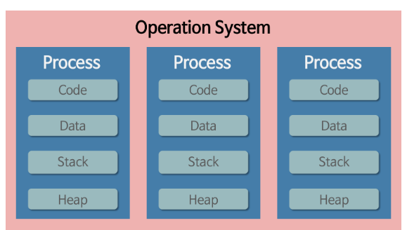

# 프로그램

어떤 작업을 위해 실행할 수 있는 파일

# 프로세스

1. 개념

   * 컴퓨터에서 연속적으로 실행되고 있는 컴퓨터 프로그램
   * 디스크로부터 메모리에 적재되어 CPU의 할당을 받을 수 있는 것

2. 할당받는 시스템 자원

   * CPU 자원 할당 시간

   * 운영되기 위해 필요한 주소 공간

   * 독립된 메모리 영역(Code, Data, Stack, Heap)

     

     * stack : 임시저장장소(함수 매개변수, 반환변수, 로컬변수)
     * Heap : 전역변수

3. 특징
   * 한 프로세스는 다른프로세스에 접근하기 위해서는 IPC(파이프, 파일 ,소켓등을 이용한 통신방법) 필요

* 

3. PCB

   1. 개념

      * 프로세스에 대한 중요한 정보 저장

      * 프로세스 생성시 생성됨

      * 프로세스 전환시 저장 및 불러오기 가능하게 함

   2. 저장되는 정보

      * 프로세스 ID : 프로세스 식별번호
      * 프로세스 상태(new, ready, running, waiting, terminated)
      * 프로그램 카운터 : 다음에 실행할 명령어의 주소
      * CPU 레지스터 
      * CPU 스케쥴링 정보 : 프로세스의 우선순위, 스케줄 큐에 대한 포인터 등
      * 메모리 관련 정보 : 페이지 테이블 or 세그먼트 테이블과 같은 정보
      * 입출력 상태 정보 : 프로세스에 할당된 입출력 장치들과 열린파일 목록
      * 어카운팅 정보 : 사용된 CPU 시간, 시간제한, 계정번호 등

# 쓰레드

1. 개념

   프로세스가 할당받는 자원을 이용하는 실행의 단위

2. 특징

   1. 프로세스 내 Code, Data, Heap 공유

   2. 독립적 할당

      * 스택

        함수는 독립적인 호출이 가능하다 -> 독립적인 실행 흐름을 추가하기 위해서 스택은 공유안하고 독립적으로 할당함

      * 레지스터 집합

        스케줄러에 의해서 명령어가 연속적으로 수행되지 못하고 어느 부분까지 수행했는지 기억할 필요가 있어서 돌깁적으로 할당함

# 멀티 프로세스

## 개념

하나의 응용프로그램을 여러 개의 프로세스로 구성하여 각 프로세스가 하나의 작업(태스크)을 처리하도록 하는 것이다.
프로그램 여러개 키는거

## 장점

* 여러 개의 자식 프로세스 중 하나에 문제가 발생하면 그 자식 프로세스만 죽는 것 이상으로 다른 영향이 확산되지 않는다.

## 단점

* Context Switching에서의 오버헤드

* 복잡한 프로세스간 통신(IPC)

  

# 멀티 쓰레드

## 개념

하나의 응용프로그램을 여러 개의 스레드로 구성하고 각 스레드로 하여금 하나의 작업을 처리하도록 하는 것이다.

하나의 프로그램으로 여러 작업 처리

## 장점

* 자원의 효율성 증대 (자원 할당과정 감소)

* 시스템 처리량 증가(자원 공유, context switching 작업량이 작음)

* 응답시간 단축(메모리 공유)

  

## 단점

* 디버깅이 까다로움
* 단일 프로세스의 경우 효과가 미비
* 다른 프로세스에서 제어 못함
* 동기화 문제(공유해서)
* 하나 프로세스 잘못되면 전체가 영향끼침

