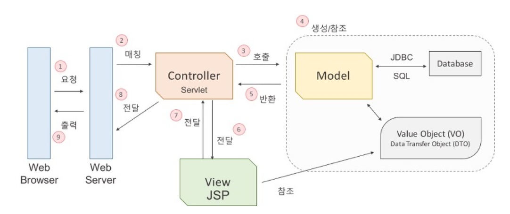

# Part 1-1 개발 CS

* [좋은 코드](#1.-좋은-코드란?)
* [객체 지향 프로그래밍](#2.-객체지향 프로그래밍)
  * 객체 지향 개발 원칙은 무엇인가?
* [RESTful API](#3.-RESTful API)
* [TDD](#4.-TDD)
* [함수형 프로그래밍](#함수형-프로그래밍)
* [MVC 패턴](#MVC 패턴)
* [Git 과 GitHub 에 대해서](#git-과-github-에-대해서)

 

# 1. 좋은 코드

- 읽기 쉬운 코드
- 중복이 없는 코드
- 테스트가 용이한 코드

# 2. 객체지향 프로그래밍

1. 개념

   * 객체 : 현실 세계의 사물들

   * 추상화 : 객체의 특징을 뽑아와 프로그래밍하는 것

2. 장점
   * 재사용성
   * 디버깅 쉬움
   * 유지보수 용이
   * 매핑 수월 -> 요구사항 파악 명확

3. 단점
   * 예측할 수 없는 상태 갖게 됨 -> 내부에서 버그 발생 가능
4. 설계원칙(SOLID)
   1. SRP(Single Responsibility Principle) : 단일 책임 원칙
      클래스는 단 하나의 책임을 가져야 하며 클래스를 변경하는 이유는 단 하나의 이유이어야 한다.
   2. OCP(Open-Closed Principle) : 개방-폐쇄 원칙
      확장에는 열려 있어야 하고 변경에는 닫혀 있어야 한다.
   3. LSP(Liskov Substitution Principle) : 리스코프 치환 원칙
      상위 타입의 객체를 하위 타입의 객체로 치환해도 상위 타입을 사용하는 프로그램은 정상적으로 동작해야 한다.
   4. ISP(Interface Segregation Principle) : 인터페이스 분리 원칙
      인터페이스는 그 인터페이스를 사용하는 클라이언트를 기준으로 분리해야 한다.
   5. DIP(Dependency Inversion Principle) : 의존 역전 원칙
      고수준 모듈은 저수준 모듈의 구현에 의존해서는 안된다.

# 3. RESTful API

1. RESTful API란?

   * API 중심에 자원이 있고 HTTP Method를 통해 자원을 처리하도록 설계하는 것
     * **리소스** 와 **행위** 를 명시적이고 직관적으로 분리한다.
     * Message 는 Header 와 Body 를 명확하게 분리해서 사용한다.
     * API 버전을 관리한다.
     * 서버와 클라이언트가 같은 방식을 사용해서 요청하도록 한다.
   
2. 장점

   * Open API 를 제공하기 쉽다.

   * 멀티플랫폼 지원 및 연동이 용이하다.

   * 원하는 타입으로 데이터를 주고 받을 수 있다.

   * 기존 웹 인프라(HTTP)를 그대로 사용할 수 있다.

3. 단점

   * 사용할 수 있는 메소드가 4 가지 밖에 없다.

   * 분산환경에는 부적합하다.

   * HTTP 통신 모델에 대해서만 지원한다.

4. REST 6가지 원칙
   * Uniform Interface
   * Stateless
   * Caching
   * Client-Server
   * Hierarchical system
   * Code on demand  
     

# 4. TDD

1. 개념

   요구되는 새로운 기능에 대한 자동화된 테스트케이스를 작성하고 해당 테스트를 통과하는 가장 간단한 코드를 작성한다. 

2. 하는거

   * 요구사항 분석 -> 테스트 케이스 작성

   * 새로운 기능 추가할 때 테스트 코드 작성

   * Refactor(TDD를 위해 여러 함수로 나누기)

     

3. 단점

   * 생산성이 좋지는 않음

   * 높은 진입장벽

   * 주객전도 될수도 있음

# 5. 함수형 프로그래밍

1. 특징

   1. immutable

      * 객체는 객체가 가지고 있는 값을 변경할 수 없다.

      * 변경하려면 새로운 객체를 생성해야됨

   2. first class citizen으로서의 function

      * 변수나 데이터 구조안에 함수를 담을 수 있어서 함수의 파라미터로 전달할 수 있고, 함수의 반환값으로 사용할 수 있다.

      * 할당에 사용된 이름과 관계없이 고유한 구별이 가능하다.

      * 함수를 리터럴로 바로 정의할 수 있다.

# 6. MVC

1. 개념

   * Model + View + Controller

     1. Model 
        * 데이터 처리(비즈니스 로직)

     2. View  
        * 화면에 출력(모델 결과값)
     3. Controller 
        * 매핑(요청에 따른 모델 호출)
        * 데이터 전달(모델, 뷰)

2. 구동 원리

​		*C/S(Client - Server)구조로 요청을 하면 그에 맞는 응답을 하는 구조를 기본으로 하고 있다.*

1. 웹 브라우저가 웹 서버에 웹 애플리케이션 실행을 요청한다. (MVC 구조가 WAS라고 보면 된다.)

2. 웹 서버는 들어온 요청을 처리할 수 있는 서블릿을 찾아서 요청을 전달한다.(Matching)

3. 서블릿은 모델 자바 객체의 메서드를 호출한다.

4. 데이터를 가공하여 값 객체를 생성하거나, JDBC를 사용하여 데이터베이스와의 인터랙션을 통해 값 객체를 생성한다.

5. 업무 수행을 마친 결과값을 컨트롤러에게 반환한다.

6. 컨트롤러는 모델로부터 받은 결과값을 View에게 전달한다.

7. JSP는 전달받은 값을 참조하여 출력할 결과 화면을 만들고 컨트롤러에게 전달한다.

8. 뷰로부터 받은 화면을 웹 서버에게 전달한다.

9. 웹 브라우저는 웹 서버로부터 요청한 결과값을 응답받으면 그 값을 화면에 출력한다.

# 7. Git

1. 개념
   * 분산버전관리시스템
2. 특징
   * 버전 공유
   * 파일 시스템의 스냅샷을 저장
3. Git Flow

Git 이란 VCS(Version Control System)에 대해서 기본적인 이해를 요구하고 있다.

* [Git 을 조금 더 알아보자 slide share](https://www.slideshare.net/ky200223/git-89251791)

Git 을 사용하기 위한 각종 전략(strategy)들이 존재한다. 해당 전략들에 대한 이해를 기반으로 Git 을 사용해야 하기 때문에 면접에서 자주 물어본다. 주로 사용되는 strategy 중심으로 질문이 들어오며 유명한 세 가지를 비교한 글을 첨부한다.

* [Gitflow vs GitHub flow vs GitLab flow](https://ujuc.github.io/2015/12/16/git-flow-github-flow-gitlab-flow/)

많은 회사들이 GitHub 을 기반으로 협업을 하게 되는데, (BitBucket 이라는 훌륭한 도구도 존재합니다.) GitHub 에서 어떤 일을 할 수 있는지, 어떻게 GitHub Repository 에 기여를 하는지 정리한 글을 첨부한다.

* [오픈소스 프로젝트에 컨트리뷰트 하기](http://guruble.com/%EC%98%A4%ED%94%88%EC%86%8C%EC%8A%A4-%ED%94%84%EB%A1%9C%EC%A0%9D%ED%8A%B8%EC%9D%98-%EC%BB%A8%ED%8A%B8%EB%A6%AC%EB%B7%B0%ED%84%B0%EB%8A%94-%EC%96%B4%EB%96%BB%EA%B2%8C-%EB%90%98%EB%8A%94-%EA%B2%83/)
* [GitHub Cheetsheet](https://github.com/tiimgreen/github-cheat-sheet)

[뒤로](https://github.com/JaeYeopHan/for_beginner)/[위로](#part-1-1-development-common-sense)

 

 

_Development_common_sense.end_

# 1. Git 개념

* 분산버전관리시스템

# 2. Git 특징

* 버전을 공유함

* 파일에 비해 용량이 작음(snpashot 차이점만 저장)

# 3. Git flow

Working directory->staging area->HEAD

Working directory : 로컬 저장소에서 수정한 파일

staging area :  commit할 목록

HEAD : version
