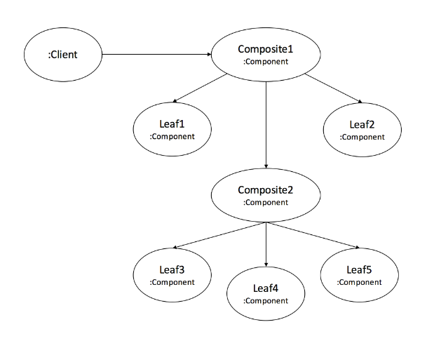
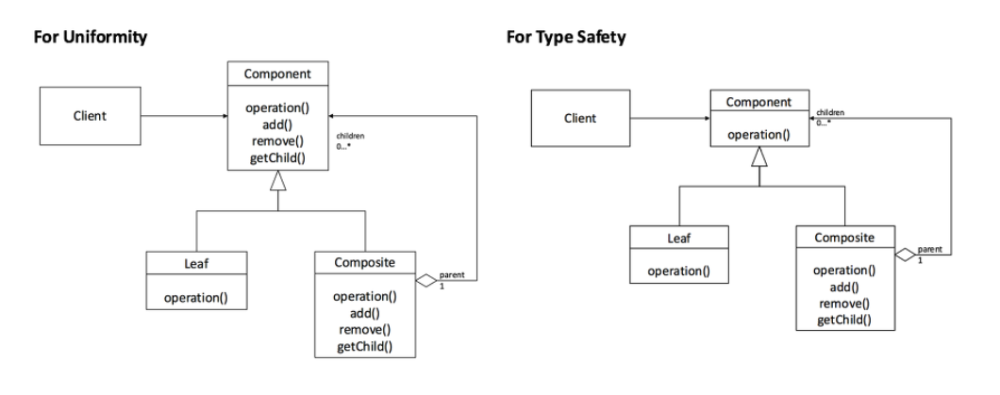

# 1. Adapter Pattern

어뎁터 class로 서로다른 interface끼리 변환없이 서로 사용가능


# 2. Composite Pattern

객체를 트리처럼 다룰 수 있음





안전성을 위해서 add, remove는 composite에서만 가능하게 함


# 3. Factory Method Pattern

객체를 만드는 부분을 Sub class에 맡기는 패턴

ex)

- RobotFactory 클래스 생성

```java
public abstract class RobotFactory {
	abstract Robot createRobot(String name);
}
```

- SuperRobotFactory 클래스 생성

```java
public class SuperRobotFactory extends RobotFactory {
	@Override
	Robot createRobot(String name) {
		switch(name) {
		case "super" :
			return new SuperRobot();
		case "power" :
			return new PowerRobot();
		}
		return null;
	}
}
```

생성하는 클래스를 따로 만듬...

그 클래스는 factory 클래스를 상속하고 있기 때문에, 반드시 createRobot을 선언해야 함.

name으로 건너오는 값에 따라서, 생성되는 Robot이 다르게 설계됨.


# 4. 