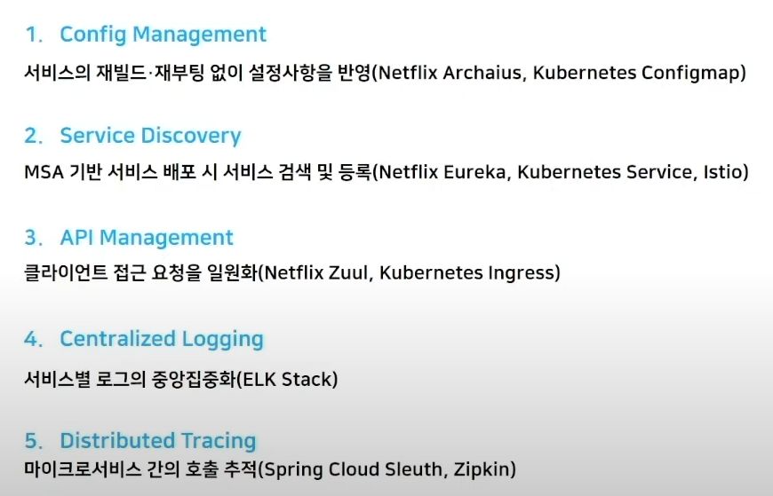
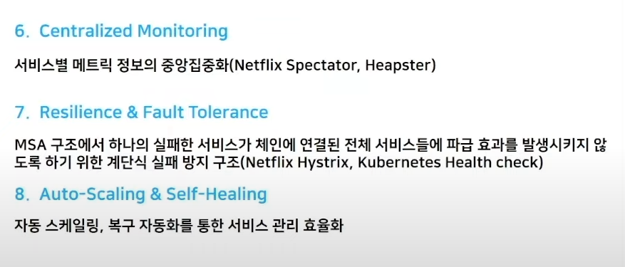
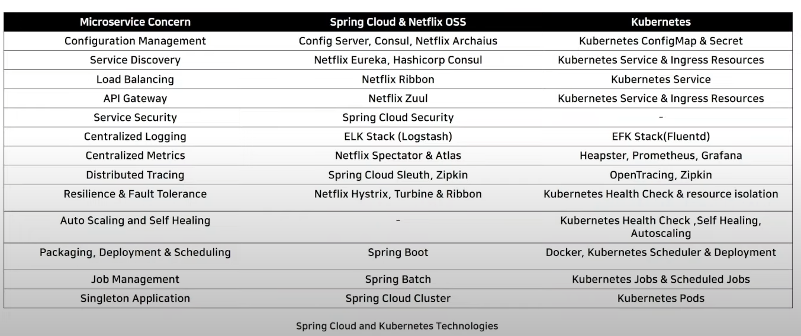
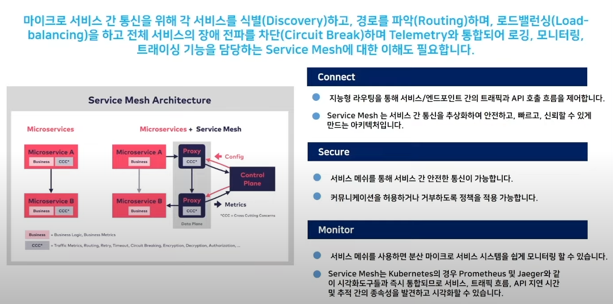
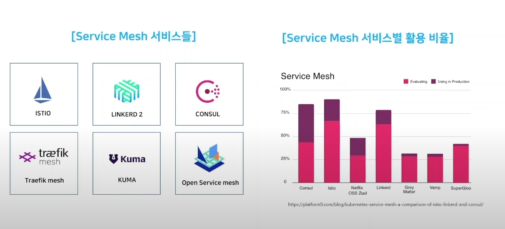

# 1. monolithic

애플리케이션 안에 모든 비즈니스 로직이 다 들어가 있는 구조

# 2. MSA

## 1. 개념

서비스를 비즈니스 경계에 맞게 세분화 하고, 서비스 간 통신은 네트워크 호출을 통해 진행하여 확장 가능하고 회복적이며 유연한 애플리케이션을 구성하는 것

## 2. 인기있는 이유

쪼개지고 느슨한 결합

1. 새로운 기능 추가 및 업데이트에 좋음
2. 서비스 하나가 장애가 생겨도 다른 서비스는 영향이 적음
3. 리소스 관리 효율적(필요한 서비스만 Scale Out 가능)
4. 민첩하고 손쉬운 배포 및 업데이트

## 3. 구성요소

1. Config Management

   환경변수를 별도의 객체로 관리

2. Service Discovery

   서비스의 위치정보 관리(IP, Port)

3. API Mangement

   API 관리(외부요청이 허용된 요청인지, 트래픽 제한)

4. Centralized Logging

   중앙화된 로그관리

5. Distributed Tracing

   서비스간의 호출을 추적할수 있는 객체

6. Centralized Monitoring

7. Resilience & Fault Tolerance

   다른서비스를 호출시 응답이 안오면 이에대한 처리 필요

8. Auto-Scaling & Self-Healing

   리소스 스케일링 자동화 

## 4. 기술

### 1. Spring Cloud or Kubernetes

Spring Cloud + kubernetes

### 2. Service Mesh Architecture

마이크로 서비스 + Service Mesh(마이크로 서비스 간 통신 전담) -> 연결, 보안, 모니터링에 좋음

ISTIO 가 가장 많이 사용됨

## 5. 활용 적용 사례

Netflix

배달의 민족

11번가

## 6. 단점

1. 복잡도가 높아야만 효과가 있음

2. 컨테이너수가 많아짐
3. 기술력의 미성숙

## 7. NAVER CLOUD

Kubernetes Service 

## 8. 추가 교육

네이버 클라우드 플랫폼 Expert Course