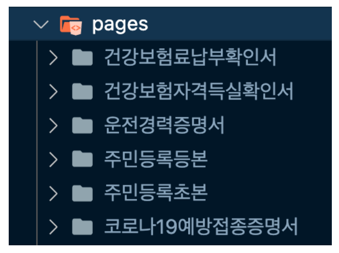

# 개념

1. URL 경로를 제어하여 URL 변경 및 매개변수 사용에 도움을 줌

2. URL 경로에 맞는 레이아웃 구성 및 컴포넌트 렌더링을 가능하게 도와줌


# 개선점

1. 라우팅 정보 리스트화

   페이지와 레이어를 리스트 형태로 만들어 각 경로에 맞는 컴포넌트들을 맵핑하여 분리하였고 해당 리스트를 렌더링하는 형태로 코드를 간소화

   1. before

   ```java
   // App.jsx
   
   import 건강보험자격득실확인서 from './건강보험자격득실확인서';
   import 코로나19예방접종증명서 from './코로나19예방접종증명서';
   import 주민등록등본 from './주민등록등본';
   import 주민등록초본 from './주민등록초본';
   import 건강보험료납부확인서 from './건강보험료납부확인서';
   import 운전경력증명서 from './운전경력증명서';
   ...
   
   const App = () => {
     ...
     return (
       ...
       <Route path="/건강보험자격득실확인서">
         <건강보험자격득실확인서 />
       </Route>
       <Route path="/코로나19예방접종증명서">
         <코로나19예방접종증명서 />
       </Route>
       <Route path="/주민등록등본">
         <주민등록등본 />
       </Route>
       <Route path="/주민등록초본">
         <건강보험자격득실확인서 />
       </Route>
       <Route path="/건강보험료납부확인서">
         <건강보험료납부확인서 />
       </Route>
       <Route path="/운전경력증명서">
         <운전경력증명서 />
       </Route>
       ...
     );
   };
   ```

   2. after

   ```java
   // routes.jsx
   
   import 건강보험자격득실확인서 from './건강보험자격득실확인서';
   import 코로나19예방접종증명서 from './코로나19예방접종증명서';
   ...
   
   const PAGE_LIST = [
     {
       path: '건강보험자격득실확인서',
       children: <건강보험자격득실확인서 />,
     },
     {
       path: '코로나19예방접종증명서',
       children: <코로나19예방접종증명서 />,
     },
     ...
   ];
   // AppRoute.jsx
   
   const AppRoute = () => {
     ...
     return (
       <>
         {PAGE_LIST.map(({path, children}) => (
           <Route path={path}>
             {children}
           </Route>
         ))}
       </>
     );
   };
   ```

   

2. 라우트 기반 코드 분할

   **[라우트 기반 코드 분할](https://ko.reactjs.org/docs/code-splitting.html#route-based-code-splitting)**은 **Route**에 설정되는 컴포넌트를 **React.lazy** 로 로딩하여 각 라우트가 경로에 맞게 동작 시 컴포넌트를 로드하여 지연 로딩되게 구성할 수 있습니다.

   Next.js 사용

3. 라우트 기반 동적 로딩

   