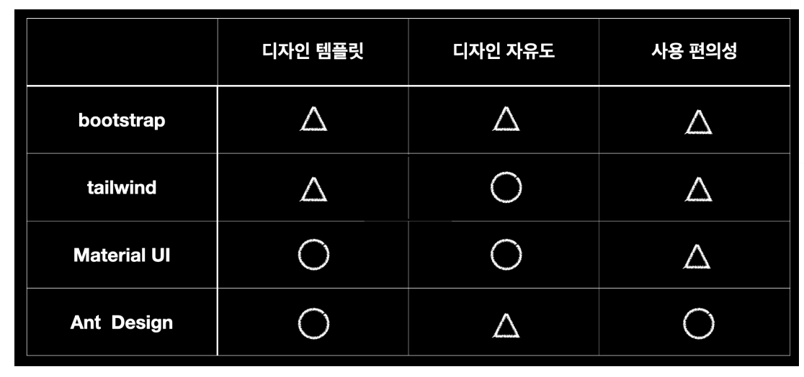

# 고려 요소

1. UI
2. API
3. UX

# UI(User Interface)

1. 프레임 워크 선택(React)

   1. jQuery : 편의성은 좋으나, 브라우저 파편화가 거의 사라져서 사용할 이유가 없음
   2. React : 사용률이 가장 높아서 문제 발생 시 쉽게 해결 가능

2. 개발환경

   1. 서버 구성

      1. FE 서버

         static 리소스 제공

      2. 운영툴 서버

         API 제공만 제공

      3. 서비스 서버

         서비스 로직

   2. React로 서버 구성 구현

      create-react-app으로 앱을 생성한 후에 start를 실행

   

3. UI 디자인 프레임워크  선택(Ant Design)

   

   1. bootstrap : 직접 디자인해야 됨
   2. tailwind : 직접 디자인해야 됨
   3. Material UI : 학습이 어려움
   4. Ant Design : 템플릿이 있어서 직접 디자인 안해도 됨

# API(Application Programmign Interface)

1. API 선택

   REST API + Gateway or proxy 설정

2. 쿼리 언어 선택(GraphQL)

   UI 컴포넌트 개발, CRUD API 개발의 반복 -> UI에 맞게 API 만들어주는게 필요 -> GraphQL

3. GraphQL

   1. 장점 
      1. 필요한 데이터만 받아올수 있음
      2. 한번에 필요한 데이터를 모두 요청할수 있음
      3. API Gateway 설정할 필요 없음
      4. Spring 지원
   2. 사용
      1. Query, Mutation, Scalar, Type을 정의
      2. Query와 Mutation 타입은 각각 QueryMapping, MutationMapping으로 구현과 연결

   3. 서비스 ㄴ, 운영툴에만 사용

      경험치가 전혀 없음 

# UX(User Experience)

1. UX 가이드

   공통 레이아웃인 GNB에는 어떤 내용이 담겨야 하는지, LNB의 메뉴는 어떤 기준으로 그룹핑하는지, Depth는 어디까지 허용할 것인지. 콘텐츠의 Body는 1단으로 할지, 2단으로 할지, 테이블로 표시할 내용이 있다면 페이징은 어떤 식으로 구성할 것인지, 각 로우를 수정할 때 수정 버튼은 어디에 위치할 것인지와 같은 세부적인 내용

2. URL 설계에 대한 가이드

   퍼머링크(Permalink) URL을 사용해 같은 URL이면 같은 화면이 보여야 한다는, 심지어 무엇인가가 선택되어 있었다면 그런 부분도 똑같이 보여야 한다고 정해두었습니다. 이 부분은 운영 데이터에 대한 URL로 커뮤니케이션을 할 때 편리하게 사용했던 것 같습니다. 또, 메뉴 이름 기반으로 URL Segment depth를 설계해 URL만 봐도 어떤 기능인지 짐작 가능하도록 가이드를 했습니다.